## <div align='center'>GIT LEARNING</div>

> This repository is used for git learning and exercises


### <div align='center'>TABLE OF CONTENTS</div>
- [Document Schematic](#document-schematic)
- [Bundle One](#bundle-one)
  - [Exercise One](#exercise-one)
  - [Exercise Two](#exercise-two)
- [Bundle Two](#bundle-two)
  - [Exercise One](#exercise-one)
  - [Exercise Two](#exercise-two)
- [Bundle Three](#bundle-three)
  - [Exercise One](#exercise-one)
  - [Exercise Two](#exercise-two)
- [Advanced Git Learning](#advanced-git-learning)
  - [Refining History: Part-1](#refining-git-history--part1)
  - [Branching Basics: Part-2](#branching-basics--part2)

## Document Schematic
> Below are some of the keyWords and interpretations of the code written below.

`user#`: This means thta that line of code is written in the console.<br>

`>`: This will represent the Output of a given Command.

## Bundle One
### Exercise One
> Below are the exercise Question criteria
1. Create a project folder & initialize git
2. Make changes to the project (add files and contents)
3. Rename your main branch from `master` to `main` (If your branch name is already `main` then rename it to `master` and then back to `main`)
4. Stage your changes and commit them
5. Create a Github repo and connect it with your project
6. Push your changes to GitHub
7. Create a new branch `dev`
8. From `dev` create another branch `test`
9. Go back to the `dev` branch and delete the `test` branch

> below are the solution steps.

1. Create a project folder & initialize git
```
user# mkdir proj_one

user# cd proj_one

user# git init

> Initialized empty Git repository in /Users/gymagasaro/Desktop/git_learning/projects/proj_one/.git/
```
2. Make changes to the project (add files and contents)
4. Stage your changes and commit them
```
user# touch page.md

user# touch .keep

user# git add .

user# git commit -m "project first commit"

> [main (root-commit) a512875] project first commit
    2 files changed, 0 insertions(+), 0 deletions(-)
    create mode 100644 .keep
    create mode 100644 page.md
```

4. Rename your main branch from `master` to `main` (If your branch name is already `main` then rename it to `master` and then back to `main`)
```
user# git branch

> main

user# git branch -m master

user# git branch

> master

user# git branch -m main

user# git branch

> main
```
5. Create a Github repo and connect it with your project
6. Push your changes to GitHub
```
user# git remote add origin git@github.com:gisachris/git_project_one.git

user# git push -u origin main

> Enumerating objects: 3, done.
    Counting objects: 100% (3/3), done.
    Delta compression using up to 8 threads
    Compressing objects: 100% (2/2), done.
    Writing objects: 100% (3/3), 242 bytes | 242.00 KiB/s, done.
    Total 3 (delta 0), reused 0 (delta 0), pack-reused 0
    To github.com:gisachris/git_project_one.git
     * [new branch]      main -> main
    branch 'main' set up to track 'origin/main'.
```
7. Create a new branch `dev`
```
user# git checkout -b dev

> Switched to a new branch 'dev'

user# git branch

>   * dev
    main
```
8. From `dev` create another branch `test`
```
user# git checkout -b test

> Switched to a new branch 'test'

user# git branch

>   dev
    main
    * test
```
9. Go back to the `dev` branch and delete the `test` branch
```
user# git checkout dev

> Switched to branch 'dev'

user# git branch -d test

> Deleted branch test (was a512875).

user# git branch

>    * dev
     main
```
<br>
<br>

---
### Exercise Two
1. Create a new `home.html` file, add some html changes and save them
2. Stash save your current changes
3. Repeat the same process for a new `about.html` page and stash save your changes
4. Repeat the same process for a new `team.html` page and stash save your changes
5. Using stash pop restore the changes of the `about.html` page
6. With the help of an index use stash pop bring back the `home.html` page changes
7. Commit the current changes and push them
8. Using stash pop restore the changes of the `team.html` page index
9. Reset the current changes using git reset and go back to the changes without the `team.html` page.

> Below are the solution steps
1. Create a new `home.html` file, add some html changes and save them.
```
user#   touch index.html

user#   ls

>       index.html

user#   nano index.html     //make changes to the file

user#   cat index.html      //preview the file

 >      <html>
 >      <head><head>
 >      <body>
 >          <p>This is some text</p>
 >      </body>
 >      </html>
```

2. Stash save your current changes
```
user#   git stash push -m "first_stash"

>       Saved working directory and index state On dev: first_stash
```
3. Repeat the same process for a new `about.html` page and stash save your changes
4. Repeat the same process for a new `team.html` page and stash save your changes
```
user#   touch about.html

user#   nano about.html         //make changes to the about page

user#   cat about.html          //preview the about page

 >      <html>
 >      <head><head>
 >      <body>
 >          <p>This is the about Page </p>
 >      </body>
 >      </html>

user#   git stash push -u -m "second_stash"

>       Saved working directory and index state On dev: second_stash

user#   touch team.html

user#   nano team.html          //make changes to the team page

user#   cat team.html          //preview the team page

 >      <html>
 >      <head><head>
 >      <body>
 >          <p>This is the Team Page </p>
 >      </body>
 >      </html>

user#   git stash push -u -m "third_stash"

>       Saved working directory and index state On dev: third_stash
```
5. Using stash pop restore the changes of the `about.html` page
```
user#   git stash list         // list all the stashes

>       stash@{0}: On dev: third_stash
>       stash@{1}: On dev: second_stash
>       stash@{2}: On dev: first_stash

user#   git stash pop stash@{1}     //restore the stash with index in the {id}

>       Already up to date.
>       On branch dev
>       Your branch is up to date with 'origin/dev'.
>       Untracked files:
>         (use "git add <file>..." to include in what will be committed)
>       	about.html
>       	index.html
>       nothing added to commit but untracked files present (use "git add" to track)
>       Dropped stash@{1} (bd011daf7ca8a11e9790d723ebac0e354fcc8903)
```
6. With the help of an `index` use `stash pop` bring back the `home.html` page changes
```
user#   git stash list

>       stash@{0}: On dev: third_stash
>       stash@{1}: On dev: second_stash
>       stash@{2}: On dev: first_stash

user#   git stash pop stash@{2}
```
7. Commit the current changes and push them
```
user#   git add .

user#   git commit -m "restore home and about pages"

>       [dev 26188b7] restore home and about pages
>        2 files changed, 12 insertions(+)
>        create mode 100644 about.html
>        create mode 100644 index.html

user#   git push -u origin dev

>        Enumerating objects: 5, done.
>        Counting objects: 100% (5/5), done.
>        Delta compression using up to 8 threads
>        Compressing objects: 100% (4/4), done.
>        Writing objects: 100% (4/4), 471 bytes | 471.00 KiB/s, done.
>        Total 4 (delta 0), reused 0 (delta 0), pack-reused 0
>        To github.com:gisachris/git_project_one.git
>           a512875..26188b7  dev -> dev
>        branch 'dev' set up to track 'origin/dev'.
```

8. Using stash pop restore the changes of the `team.html` page index.
```
user#   git stash list

>       stash@{0}: On dev: third_stash
>       stash@{1}: On dev: second_stash
>       stash@{2}: On dev: first_stash

user#   git stash pop stash@{0}
```

9. Reset the current changes using `git reset` and go back to the changes without the `team.html` page.
```
user#   git reset --hard HEAD~1
```
<br>

---


## Bundle Two
### Exercise One
> Below are the exercise Question criteria
1. Create a new branch named `ft/bundle-2`
2. Add new changes to your project. create a new page named `services.html` and add some changes
3. Commit your changes and create a Pull Request against the `main` branch in your github repository
4. Request a review and make sure your Pull request gets merged (Look for someone to merge your PR)

1. Create a new branch named `ft/bundle-2`
```
user#   git checkout -b ft/bundle-2

>       Switched to a new branch 'ft/bundle-2'
```
2. Add new changes to your project. create a new page named `services.html` and add some changes
```
user#       touch services.html

user#       nano services.html          // make changes to the services.html page

user#       cat services.html           //preview the changes

>           <html>
>             <body>
>               <p>this is the services page</p>
>             </body>
>           </html>
```

3. Commit your changes and create a Pull Request against the `main` branch in your github repository
```
user#       git add .

user#       git commit -m "implement the services page"

>           [ft/bundle-2 3617987] implement the services page
>            1 file changed, 5 insertions(+)
>            create mode 100644 services.html

user#   git push -u origin ft/bundle-2

>       Total 0 (delta 0), reused 0 (delta 0), pack-reused 0
>       remote: 
>       remote: Create a pull request for 'ft/bundle-2' on GitHub by visiting:
>       remote:      https://github.com/gisachris/git_project_one/pull/new/ft/bundle-2
>       remote: 
>       To github.com:gisachris/git_project_one.git
>        * [new branch]      ft/bundle-2 -> ft/bundle-2
>       branch 'ft/bundle-2' set up to track 'origin/ft/bundle-2'.
```
4. Request a review and make sure your Pull request gets merged (Look for someone to merge your PR)

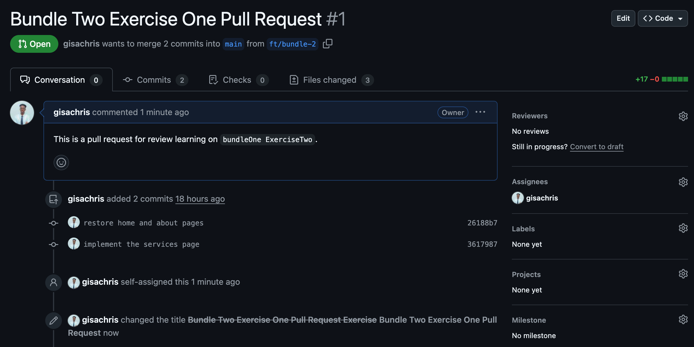

<br>

---
### Exercise Two
> Below are the exercise Question criteria
1. Checkout your `main` branch and pull the latest changes
2. Create a new branch named `ft/service-redesign`
3. Add new changes to the `service.html` page
4. commit and push them
5. create a new PR for your changes
6. go back to your `main` branch and add again new changes to your `service.html` page, you can add different changes but make sure to affect the same part(line of code) as you did in the other PR
7. Commit and push those changes
8. Now go back to the Github PR you had created for the `ft/service-redesign`branch, you will then see that you have conflicts with the `main` branch
9. In your project checkout the `ft/service-redesign`branch
10. Compare the `ft/service-redesign`with the `main` branch using git diff and observe the changes
11. Using git merge, merge the `main` branch with `ft/service-redesign` branch and commit and push you changes again

    
  
1a. Checkout your `main` branch and pull the latest changes
```
user#       git switch main

>           Switched to branch 'main'
>           Your branch is up to date with 'origin/main'.

user#       git pull origin main

>           remote: Enumerating objects: 1, done.
>           remote: Counting objects: 100% (1/1), done.
>           remote: Total 1 (delta 0), reused 0 (delta 0), pack-reused 0 (from 0)
>           Unpacking objects: 100% (1/1), 913 bytes | 304.00 KiB/s, done.
>           From github.com:gisachris/git_project_one
>            * branch            main       -> FETCH_HEAD
>              a512875..99eab8c  main       -> origin/main
>           Updating a512875..99eab8c
>           Fast-forward
>            about.html    | 6 ++++++
>            index.html    | 6 ++++++
>            services.html | 5 +++++
>            3 files changed, 17 insertions(+)
>            create mode 100644 about.html
>            create mode 100644 index.html
>            create mode 100644 services.html
```
2. Create a new branch named `ft/service-redesign`
3. Add new changes to the `service.html` page
```
user#        git checkout -b ft/service-redesign

>            Switched to a new branch 'ft/service-redesign'

>            nano services.html            //make changes to the services.html page
```
4. commit and push them
```
user#        git add .

user#        git commit -m "make changes to the services page"

>            [ft/service-redesign 0b13082] make changes to the services page
>              1 file changed, 1 insertion(+)

user#        git push -u origin ft/service-redesign

>            Enumerating objects: 5, done.
>            Counting objects: 100% (5/5), done.
>            Delta compression using up to 8 threads
>            Compressing objects: 100% (3/3), done.
>            Writing objects: 100% (3/3), 360 bytes | 360.00 KiB/s, done.
>            Total 3 (delta 1), reused 0 (delta 0), pack-reused 0
>            remote: Resolving deltas: 100% (1/1), completed with 1 local object.
>            remote: 
>            remote: Create a pull request for 'ft/service-redesign' on GitHub by visiting:
>            remote:      https://github.com/gisachris/git_project_one/pull/new/ft/service-redesign
>            remote: 
>            To github.com:gisachris/git_project_one.git
>            * [new branch]      ft/service-redesign -> ft/service-redesign
>            branch 'ft/service-redesign' set up to track 'origin/ft/service-redesign'
```
5. create a new PR for your changes
<br>
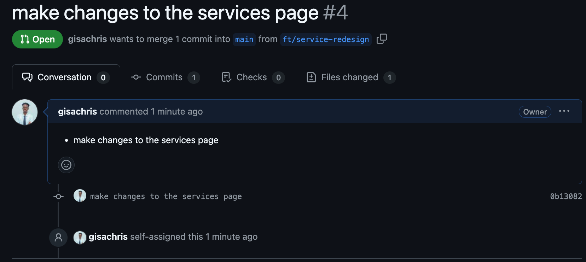
<br>
6. go back to your `main` branch and add again new changes to your `service.html` page, you can add different changes but make sure to affect the same part(line of code) as you did in the other PR
```
user#       git switch main

user#       nano services.html

user#       cat services.html

>           <html>
>             <body>
>               <p>this is the services page</p>
>               <span>This is a slight change on the same line</span>
>             </body>
>           </html>

```
7. Commit and push those changes
```
user#       git add .

user#       git commit -m "chasnged the same line on services.html page"

>           [main e143925] chasnged the same line on services.html page
>            1 file changed, 1 insertion(+)

user#       git push

>           Enumerating objects: 5, done.
>           Counting objects: 100% (5/5), done.
>           Delta compression using up to 8 threads
>           Compressing objects: 100% (3/3), done.
>           Writing objects: 100% (3/3), 385 bytes | 385.00 KiB/s, done.
>           Total 3 (delta 1), reused 0 (delta 0), pack-reused 0
>           remote: Resolving deltas: 100% (1/1), completed with 1 local object.
>           To github.com:gisachris/git_project_one.git
>              99eab8c..e143925  main -> main
 ```
8. Now go back to the Github PR you had created for the `ft/service-redesign`branch, you will then see that you have conflicts with the `main` branch
<br>
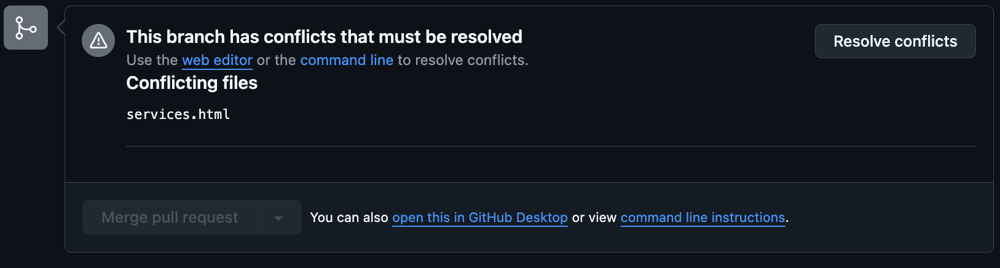
<br>
9. In your project checkout the `ft/service-redesign`branch
```
user#        git checkout ft/service-redesign

>            Switched to branch 'ft/service-redesign'
>            Your branch is up to date with 'origin/ft/service-redesign'.
```
10. Compare the `ft/service-redesign`with the `main` branch using git diff and observe the changes
```
user#        git diff main

>            diff --git a/services.html b/services.html
>            index 36ae9a3..189b85c 100644
>            --- a/services.html
>            +++ b/services.html
>            @@ -1,6 +1,6 @@
>             <html>
>               <body>
>                 <p>this is the services page</p>
>            -    <span>This is a slight change on the same line</span>
>            +    <p>This is the redesign of this page</p>
>               </body>
>             </html>
```
11. Using git merge, merge the `main` branch with `ft/service-redesign` branch and commit and push you changes again
```
>             git merge main

>             Auto-merging services.html
>             CONFLICT (content): Merge conflict in services.html
>             Automatic merge failed; fix conflicts and then commit the result.

user#         git checkout --ours .                 //this favours changes of the current branch in the conflict

>             Updated 1 path from the index

user#         git add .

user#         git commit -m "fix comflict with services file"

>             [ft/service-redesign c1b6a59] fix comflict with services file

user#         git Push

>             Enumerating objects: 1, done.
>             Counting objects: 100% (1/1), done.
>             Writing objects: 100% (1/1), 243 bytes | 243.00 KiB/s, done.
>             Total 1 (delta 0), reused 0 (delta 0), pack-reused 0
>             To github.com:gisachris/git_project_one.git
>                0b13082..c1b6a59  ft/service-redesign -> ft/service-redesign
```

<br>

---

## Bundle Three
### Exercise One
> Below are the exercise Question criteria
1. Create a new branch named `ft/team-page`
2. Create a new html page named `team.html` and add some changes
3. commit and push those changes
4. Create a new PR for the changes
5. Go back to `main` branch (checkout the `main` branch)
6. Create new branch named `ft/contact-page`
7. Go back to the `ft/team-page`
8. With the help of git log look for the last commit and copy its hash
9. Checkout again `ft/contact-page` using git cherry-pick get the changes from the last commit on the `ft/team-page` branch.
10. Add new changes for the contact page and commit, push them
11. Create a new PR for the contact page
12. From the `ft/contact-page` branch create a new branch called `ft/faq-page`
13. Create a new `faq.html` page and add some changes there
14. Commit and push those changes
15. Using git revert, revert the changes of the last commit of the `ft/team-page` branch. (use the commit hash you copied earlier)
16. Push the changes and create a new PR
<br>
<br>

1A. Create a new branch named `ft/team-page`
```
user#   git checkout -b ft/team-page

>       Switched to a new branch 'ft/team-page'
```
2. Create a new html page named `team.html` and add some changes
```
user#   touch team.html

user#   nano team.html         //add changes  to the team.html file

user#   cat team.html         //preview the team.html file

>       <html>
>        <body>
>         <p>This is the team page</p>
>        </body>
>       </html>
```
3. commit and push those changes
```
user#   git add .

user#   git commit -m "enter code in team.html file"

>       [ft/team-page 1884b87] enter code in team.html file
>        1 file changed, 5 insertions(+)
>        create mode 100644 team.html

user#     git push -u origin ft/team-page

>         Enumerating objects: 4, done.
>         Counting objects: 100% (4/4), done.
>         Delta compression using up to 8 threads
>         Compressing objects: 100% (3/3), done.
>         Writing objects: 100% (3/3), 350 bytes | 350.00 KiB/s, done.
>         Total 3 (delta 1), reused 0 (delta 0), pack-reused 0
>         remote: Resolving deltas: 100% (1/1), completed with 1 local object.
>         remote: 
>         remote: Create a pull request for 'ft/team-page' on GitHub by visiting:
>         remote:      https://github.com/gisachris/git_project_one/pull/new/ft/team-page
>         remote: 
>         To github.com:gisachris/git_project_one.git
>          * [new branch]      ft/team-page -> ft/team-page
>         branch 'ft/team-page' set up to track 'origin/ft/team-page'.
```
4. Create a new PR for the changes
<br>
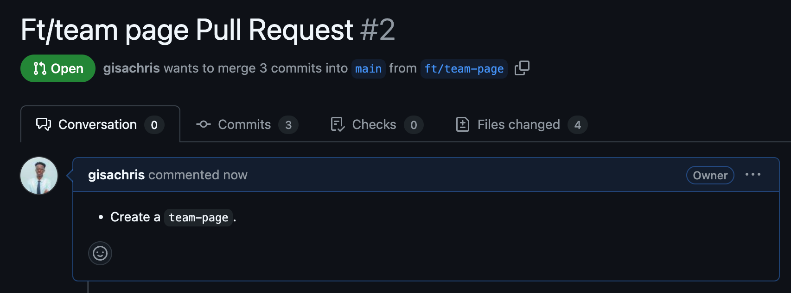
<br>
5. Go back to `main` branch (checkout the `main` branch)
```
user#     git checkout main

>         Switched to branch 'main'
>         Your branch is up to date with 'origin/main'.
```
6. Create new branch named `ft/contact-page`
7. Go back to the `ft/team-page`
```
user#     git checkout -b ft/contact-page

>         Switched to a new branch 'ft/contact-page'

user#     git switch ft/team-page

>         Switched to branch 'ft/team-page'
>         Your branch is up to date with 'origin/ft/team-page'.
```
8. With the help of git log look for the last commit and copy its hash
```
user#     git log --oneline

>         1884b87 (HEAD -> ft/team-page, origin/ft/team-page) enter code in team.html file
>         3617987 (origin/ft/bundle-2, ft/bundle-2) implement the services page
>         26188b7 (origin/dev, dev) restore home and about pages
>         a512875 (origin/main, main, ft/contact-page) project first commit
```
9. Checkout again `ft/contact-page` using git cherry-pick get the changes from the last commit on the `ft/team-page` branch.
```
user#     git checkout ft/contact-page

>         Switched to branch 'ft/contact-page'

user#     git cherry-pick 1884b87

>         [ft/contact-page 4770a30] enter code in team.html file
>          Date: Thu Dec 19 10:40:57 2024 +0200
>          1 file changed, 5 insertions(+)
>          create mode 100644 team.html
```
10. Add new changes for the contact page and commit, push them
```
user#     touch contacts.html

user#     nano contacts.html        //make changes to the contacts.html page

user#     cat contacts.html         //preview the contatcs.html page

>         <html>
>           <body>
>             <p>This is the contact page</p>	
>           </body>
>         </html>

user#     git add .

user#     git commit -m "implement cvhangers on the contacts page"

>         [ft/contact-page f993ebd] implement cvhangers on the contacts page
>          1 file changed, 5 insertions(+)
>          create mode 100644 contacts.html

user#     git push -u origin ft/contact-page

>         Enumerating objects: 7, done.
>         Counting objects: 100% (7/7), done.
>         Delta compression using up to 8 threads
>         Compressing objects: 100% (6/6), done.
>         Writing objects: 100% (6/6), 677 bytes | 677.00 KiB/s, done.
>         Total 6 (delta 1), reused 0 (delta 0), pack-reused 0
>         remote: Resolving deltas: 100% (1/1), done.
>         remote: 
>         remote: Create a pull request for 'ft/contact-page' on GitHub by visiting:
>         remote:      https://github.com/gisachris/git_project_one/pull/new/ft/contact-page
>         remote: 
>         To github.com:gisachris/git_project_one.git
>          * [new branch]      ft/contact-page -> ft/contact-page
>         branch 'ft/contact-page' set up to track 'origin/ft/contact-page'.
```

11. Create a new PR for the contact page
<br>
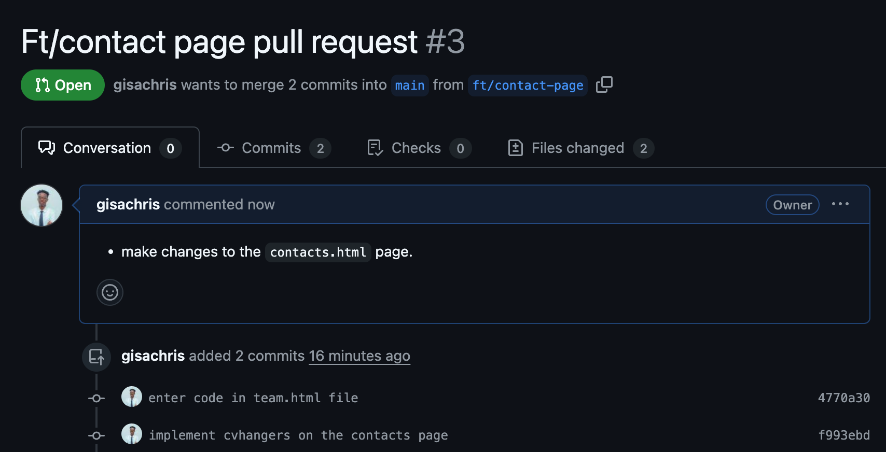
<br>
12. From the `ft/contact-page` branch create a new branch called `ft/faq-page`
13. Create a new `faq.html` page and add some changes there
```
user#     git checkout -b ft/faq-page

>         Switched to a new branch 'ft/faq-page'

user#     touch faq.html

user#     nano faq.html

user#     cat faq.html

>         <html>
>          <body>
>           <p>this is thew faq page</p>
>          </body>
>         </html>
```
14. Commit and push those changes
```
user#     git add faq.html

user#     git commit -m "implement changes on the faq page"

>         [ft/faq-page 07b64be] implement changes on the faq page
>          1 file changed, 5 insertions(+)
>          create mode 100644 faq.html

user#     git push -u origin ft/faq-page

>         Enumerating objects: 4, done.
>         Counting objects: 100% (4/4), done.
>         Delta compression using up to 8 threads
>         Compressing objects: 100% (3/3), done.
>         Writing objects: 100% (3/3), 349 bytes | 349.00 KiB/s, done.
>         Total 3 (delta 1), reused 0 (delta 0), pack-reused 0
>         remote: Resolving deltas: 100% (1/1), completed with 1 local object.
>         remote: 
>         remote: Create a pull request for 'ft/faq-page' on GitHub by visiting:
>         remote:      https://github.com/gisachris/git_project_one/pull/new/ft/faq-page
>         remote: 
>         To github.com:gisachris/git_project_one.git
>          * [new branch]      ft/faq-page -> ft/faq-page
>         branch 'ft/faq-page' set up to track 'origin/ft/faq-page'.
```
15. Using git revert, revert the changes of the last commit of the `ft/team-page` branch. (use the commit hash you copied earlier)
```
user#     git checkout ft/team-page

>         Switched to branch 'ft/team-page'
>         Your branch is up to date with 'origin/ft/team-page'.

user#     git revert 1884b87

>         [ft/team-page a3aa14b] Revert "enter code in team.html file"
>          1 file changed, 5 deletions(-)
>          delete mode 100644 team.html    
```
16. Push the changes and create a new PR
<br>
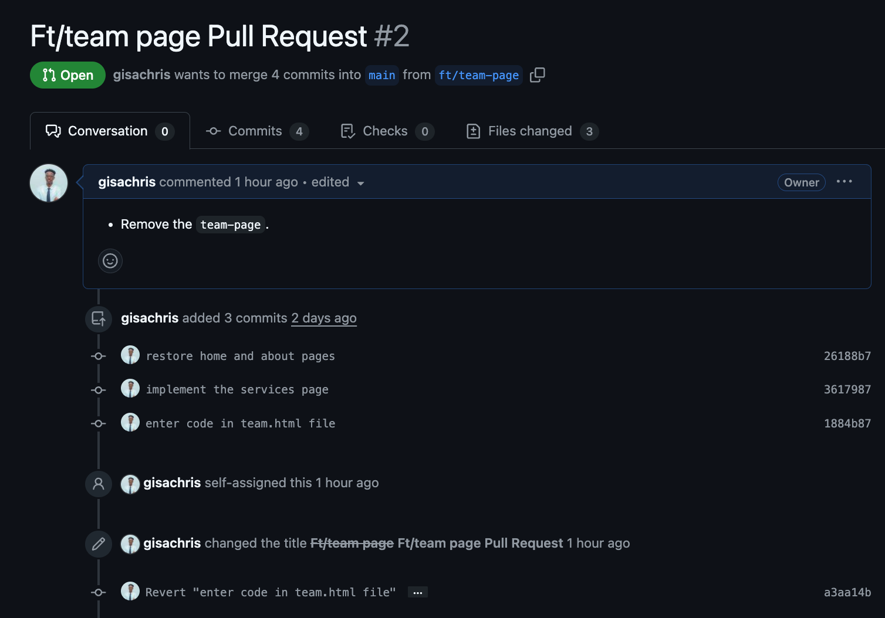
<br>
<br>


## <div align='center'>ADVANCED GIT LEARNING</div>
### REFINING GIT HISTORY  (PART1)

#### <p style="text-decoration: underline">Missing File Fix:</p>
<strong>Challenge:</strong>
Recover from An error where you have to forgot to add a file to the commit it belongs to by staging/adding test4.md and amending the commit message with an appropriate description.

<br>
<strong>Solution:</strong><br>
1. Add the missing file to the staging area
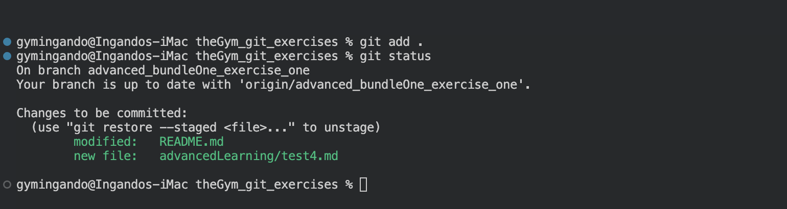
<br>
<br>

2.Use `git commit --ammend -m <message>` to recommit to the previous commit and also change the commit message.
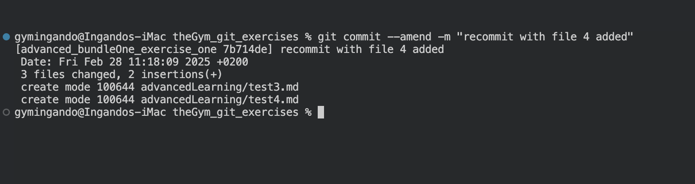
<br>
<br>
#### <p style="text-decoration: underline">Editing Commit History:</p>
<strong>Challenge:</strong> Utilize interactive rebasing (git rebase -i HEAD~2) to edit the commit message and ensure clarity. Modify the message from `Create another file` to `Create second file`.

<br>
<strong>Solution:</strong><br>
1. Enter the interactive rebasing Window (git rebase -i HEAD~2 || <commit>)

#### <p style="text-decoration: underline">Editing Commit History:</p>
<strong>Challenge:</strong> Utilize interactive rebasing (git rebase -i HEAD~2) to edit the commit message and ensure clarity. Modify the message from `Create another file` to `Create second file`.

<br>
<strong>Solution:</strong><br>
1. Enter the interactive rebasing Window (git rebase -i HEAD~num | commit_hash)

<br>
<br>

2.Enter the `Interactive` mode with `i`

<br>
<br>

3.Make the required change in this case `pick` to `reword` and also change the commit in the next pop up window.

<br>
<br>

4.exit the window and save by running `esc :wq`

<br>
<br>

#### <p style="text-decoration: underline">Editing Commit History:</p>
<strong>Challenge:</strong> Utilize interactive rebasing (git rebase -i HEAD~2) to edit the commit message and ensure clarity. Modify the message from `Create another file` to `Create second file`.

<br>
<strong>Solution:</strong><br>
1. Enter the interactive rebasing Window (git rebase -i HEAD~num | commit_hash)

<br>
<br>

2.Enter the `Interactive` mode with `i`

<br>
<br>

3.Make the required change in this case `pick` to `reword` and also change the commit in the next pop up window.

<br>
<br>

4.exit the window and save by running `esc :wq`

<br>
<br>


#### <p style="text-decoration: underline">Keeping History Tidy - Squashing Commits:</p>
<strong>Challenge:</strong>Let's merge "Create second file" into "Create initial file" for a cleaner history.Use interactive rebasing with the squash command to achieve this.
<br>
<br>

<strong>Solution:</strong><br>
1.Enter the interactive rebasing Window (git rebase -i HEAD~num | commit_hash)

<br>

2.Change all the commits we want to `squash` from `pick` to `squash`

3.In the new Window optionally you can provide a `new commit` for the changes or use the last commit message.

4.save changes with `esc :wq`

<br>
<br>

5.If you check the log u can see the `create second file` commit has been squashed.

<br>
<br>

#### <p style="text-decoration: underline">Splitting a Commit:</p>
<strong>Challenge:</strong> Leverage git reset to separate the files into individual commits with distinct messages by Imagining "Create third and fourth files" describes too much at once. Separate them for better tracking with two different commit messages: "Create Third File" and "Create fourth file".

<br>
<strong>Solution:</strong><br>

1.Start by getting the `commit hash` with `git reflog`.

<br>
<br>

2.Now enter the `interactive rebase` with the `previous commit hash` form the one you want to edit.

<br>
<br>

3.Change the `pick` of the commit you want to split to `edit`.

<br>
<br>

4.Now `reset` All committed changes within that `commit` with the below command.
```
git reset HEAD~
```
<br>

5.Now `re-add` and `re-commit` to your preferences

<br>
<br>

6.Continue the Rebase till completion

<br>
<br>

7.Check the commit logs to check if the change was succesful.

<br>
<br>

#### <p style="text-decoration: underline">Advanced Squashing</p>
<strong>Challenge:</strong>Combine the last two commits ("Create third file" and "Create fourth file") into a single commit named "Create third and fourth files"
<br>
<br>

<strong>Solution:</strong><br>
1.get the `parent commit` to the commits above.
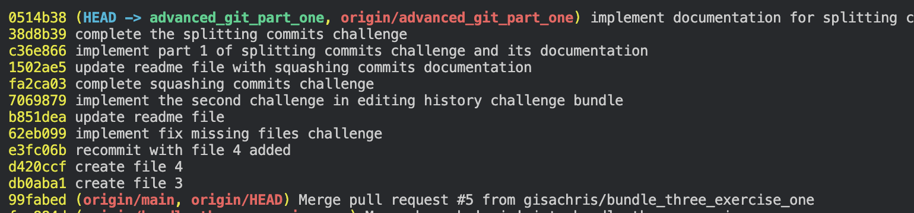
<br>
<br>

2.start the `interactive rebase` with that commit.

<br>
<br>

3.change the `pick` of the commit to `squash`. NB:`not 'edit' but 'squash'`.

<br>
<br>

4.Provide a new commit message, save and exit thew `interactive rebase`.
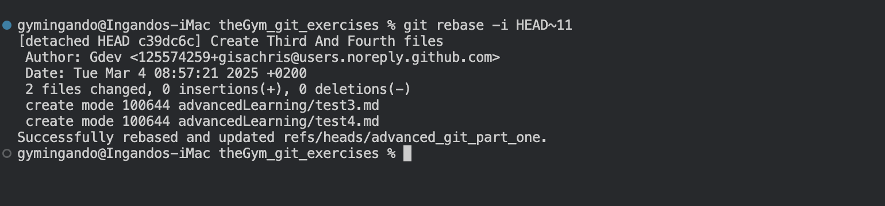
<br>
<br>

5.Check to see if the changes have been implemented.
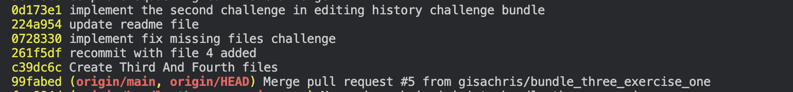
<br>
<br>

#### <p style="text-decoration: underline">Reordering Commits:</p>
<strong>Observation:</strong><br>
We can reorder commits by changing the order of the commits in the `interactive rebase` window.

<br>
<br>

#### <p style="text-decoration: underline">Cherry-Picking Commits</p>
<strong>Challenge:</strong>
<br>
<br>

<strong>Solution:</strong><br>
1.Get the `commit-hash` of the commit you want to add.


2.Take the `commit-hash` you wish to copy and return to your working branch and run the command `git chery-pick <commit-hash>`


3.Check to see if the changes have been implemented.

<br>
<br>

#### <p style="text-decoration: underline">Visualizing Commit History (Bonus):</p>
<strong>Observation:</strong><br>
Tools like `git log --graph` or a `graphical Git client` can help visualize your `commit history`. Explore these tools for a clearer understanding of your workflow.
<br>
<br>

<strong>Solution:</strong><br>
1.Using `git log --graph`.


#### <p style="text-decoration: underline">Understanding Reflogs (Bonus):</p>
<strong>Observation:</strong><br>
`Reflogs` compared to `logs` in git show the `local history` of a repository including any `commit amends`, `resetting` or other things done to the history of the repository. While `log` only shows the `standard commits` and `commit history` that everyone shares even when they `clone` the repository.
<br>
<br>

<strong>Solution:</strong><br>
1.Using `git reflog`(`Local-History` specific to one user's work directory and changes to the repository).


1.Using `git log`(history shared across all users with the repository).


### Branching Basics  (PART2)
#### <p style="text-decoration: underline">Feature Branch Creation</p>
<strong>Challenge:</strong><br>
 Create a `new branch` named `ft/new-feature` and switch to that branch.
<br>
<br>

<strong>Solution:</strong><br>
1.Create the new branch `ft/new-feature`


2.Check if the branch has been created succesfully


3.(optional) while you are on another branch you can use both `checkout` and `switch` to go back to our newly created branch.


